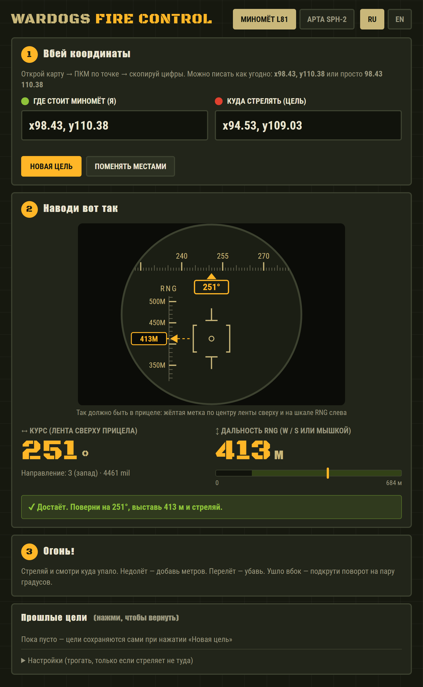
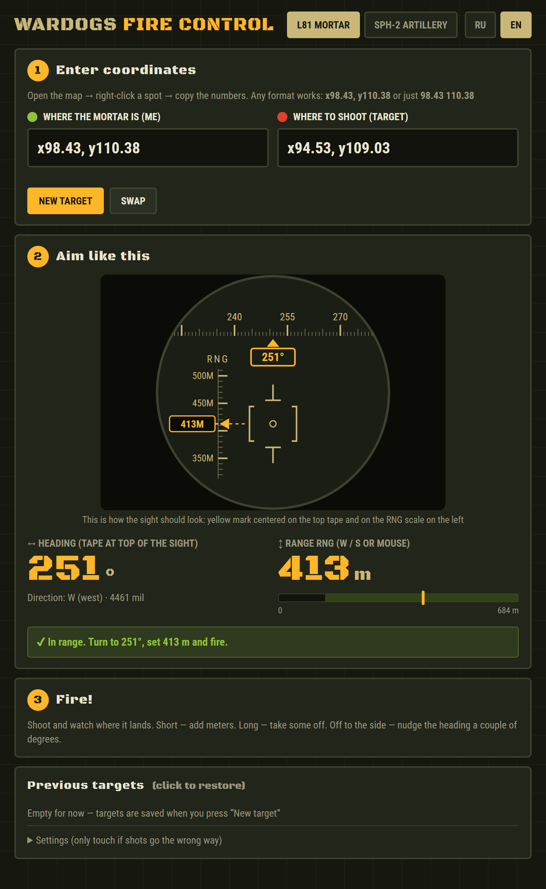

<div align="center">

# 💣 WARDOGS Fire Control

**Калькулятор миномёта и артиллерии для [WARDOGS](https://store.steampowered.com/app/1867240/WARDOGS/)**
**Mortar & artillery calculator for [WARDOGS](https://store.steampowered.com/app/1867240/WARDOGS/)**

[](https://officialdasper.github.io/wardogs_motar/)

[](https://store.steampowered.com/app/1867240/WARDOGS/)


[Русский](#-русский) · [English](#-english)

<table>
<tr>
<td align="center"><b>Русский</b></td>
<td align="center"><b>English</b></td>
</tr>
<tr>
<td><a href="https://officialdasper.github.io/wardogs_motar/?lang=ru"></a></td>
<td><a href="https://officialdasper.github.io/wardogs_motar/?lang=en"></a></td>
</tr>
</table>

</div>

---

## 🇷🇺 Русский

Вбиваешь свои координаты и координаты цели — получаешь **курс** и **дальность**, которые надо выставить в прицеле. Без формул в уме и без калькулятора на телефоне.

### ⚡ Как пользоваться

1. **Открой** 👉 **[officialdasper.github.io/wardogs_motar](https://officialdasper.github.io/wardogs_motar/)** — ничего устанавливать не нужно.
2. В игре открой карту, **ПКМ по своей позиции** — скопируй координаты в поле «Где стоит миномёт».
3. **ПКМ по цели** — координаты в поле «Куда стрелять».
4. Выставь в прицеле **курс** (лента сверху) и **дальность RNG** (шкала слева, `W` / `S`) — схема прицела в калькуляторе показывает, как это должно выглядеть.
5. Огонь! 💥

### ✨ Что умеет

| | |
|---|---|
| 🎯 **Схема прицела** | Показывает ленту курса и шкалу RNG, как в игре |
| 🧮 **Курс и дальность** | Градусы, милы и расстояние в метрах |
| 🚦 **Проверка дальности** | Предупредит, если цель слишком далеко или близко |
| 🔫 **Два орудия** | Миномёт L81 (132–684 м) и артиллерия SPH-2 (780–2629 м) |
| 📋 **Любой формат** | `x98.43, y110.38`, `98.43 110.38`, `98,43 110,38` |
| 🕘 **История целей** | Последние 10 целей, возврат в один клик |
| 🌐 **RU / EN** | Переключатель языка в углу |

### 📐 Как считается

```
дистанция = 100 × √((X_цели − X_мой)² + (Y_цели − Y_мой)²)
курс      = atan2(ΔX, ΔY)   // 0° = север, по часовой
```

Одна единица координат на карте = 100 м.

### 💾 Офлайн

Скачай [`index.html`](index.html) (**Code → Download ZIP**) и открой двойным кликом — работает без интернета.

---

## 🇬🇧 English

Enter your coordinates and the target's — get the **heading** and **range** to dial into the sight. No mental math, no phone calculator.

### ⚡ How to use

1. **Open** 👉 **[officialdasper.github.io/wardogs_motar/?lang=en](https://officialdasper.github.io/wardogs_motar/?lang=en)** — nothing to install.
2. In game, open the map, **right-click your position** — paste the coordinates into "Where the mortar is".
3. **Right-click the target** — paste into "Where to shoot".
4. Set the **heading** (top tape) and **RNG** (left scale, `W` / `S`) in the sight — the sight diagram shows exactly how it should look.
5. Fire! 💥

### ✨ Features

| | |
|---|---|
| 🎯 **Sight diagram** | Heading tape and RNG scale, just like in game |
| 🧮 **Heading & range** | Degrees, mils and distance in meters |
| 🚦 **Range check** | Warns when the target is too far or too close |
| 🔫 **Two weapons** | L81 Mortar (132–684 m) and SPH-2 Artillery (780–2629 m) |
| 📋 **Any format** | `x98.43, y110.38`, `98.43 110.38`, `98,43 110,38` |
| 🕘 **Target history** | Last 10 targets, restore in one click |
| 🌐 **RU / EN** | Language switch in the corner |

### 📐 The math

```
distance = 100 × √((X_target − X_me)² + (Y_target − Y_me)²)
heading  = atan2(ΔX, ΔY)   // 0° = north, clockwise
```

One map coordinate unit = 100 m.

### 💾 Offline

Download [`index.html`](index.html) (**Code → Download ZIP**) and double-click it — works without internet.

---

<div align="center">
<sub>Fan-made tool, not affiliated with the WARDOGS developers. · Фанатский проект, не связан с разработчиками WARDOGS.</sub>
</div>
